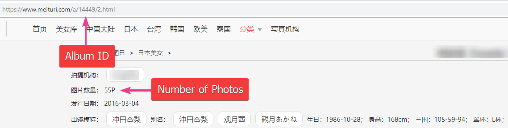
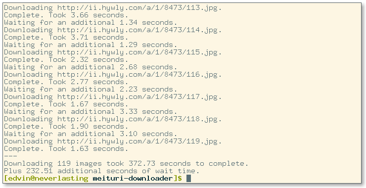

# :ribbon: Meituri Album Downloader

**Not safe for work (NSFW)**.  
A command line script that lets you download albums with given IDs from [meituri.com](https://www.meituri.com/).  
The album ID and the number of photos in the album are needed inputs to start downloading the images.


```
usage: meituri.py [-h] -a ID -n pics

Album downloader for meituri.com.

optional arguments:
  -h, --help            show this help message and exit

required arguments:
  -a ID, --album ID     album ID located in the URL: https://www.meituri.com/a/$ID
  -n pics, --number pics
                        number of pictures on top of the page followed by P
```

**(12th Mar of 2019) Notice:** After adding a minimum of 5 seconds time delay between downloads, they seem to work fine.

**(24th Feb of 2019) Notice:** I'm getting `an existing connection was forcibly closed by the remote host` error or it just hangs still (can't even CTRL + C) after 5-6 images. Maybe it's just me.

## How to

Usage in command line:

```
python meituri.py -a album_id -n num_of_pics
```

Example:
```
python meituri.py -a 14449 -n 55
```



### Explanation:
Attempts to download the album with the ID of 14449 that has 55 pictures in it.  
URL of the example: https://www.meituri.com/a/14449/

IDs are in the URL when viewing an album after the `/a/` and before whatever page you might be on.  
Same example with page:	https://www.meituri.com/a/14449/2.html  
ID is 14449.

Number of pictures are located on top of the page with the other set info.
```
  拍摄机构： [agency name]
  图片数量： 55P <-- Number of pictures, has a P next to it
  发行日期： 2016-03-04
```
Model name, alias and other info is below this information on the website if you want to check more of the model.

### Result:

_On a different gallery but still_.


